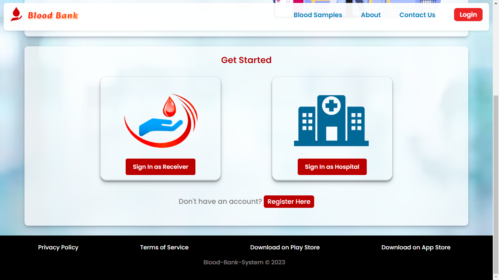
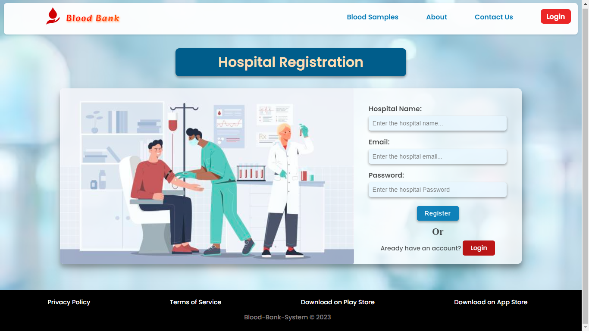
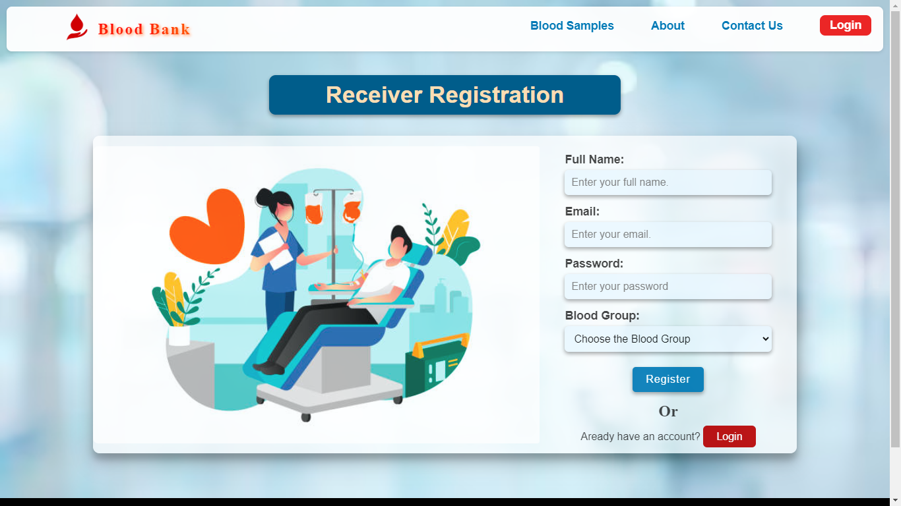
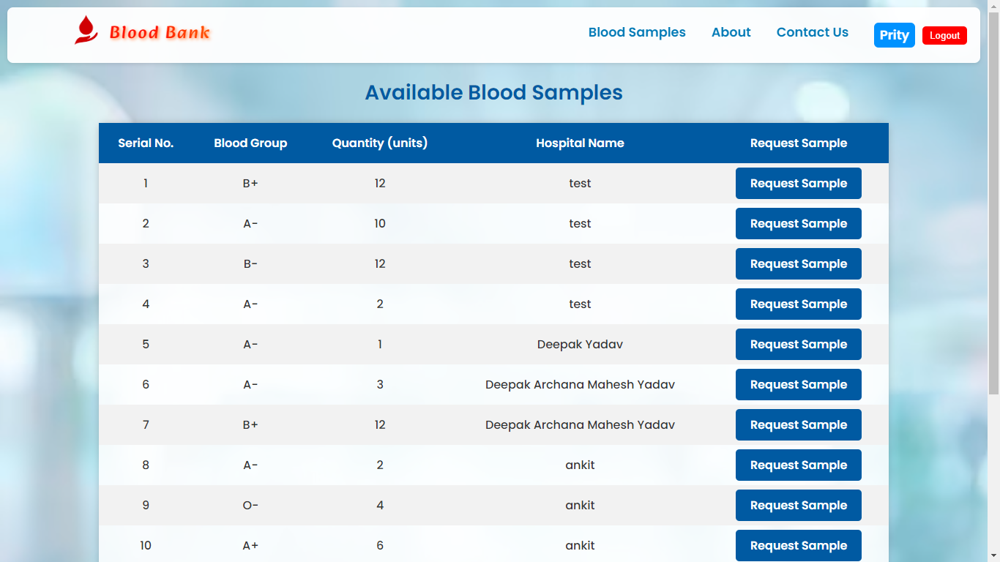

# BloodBankSystem
A platform where blood reciver can request for blood and hospitals can add blood in their blood-bank

## Homepage of platorm

## Registeration options for Reciever and Hospital

## Registeration page for Hospital

## Registeration page for Reciever

## the Available blood Sample page

